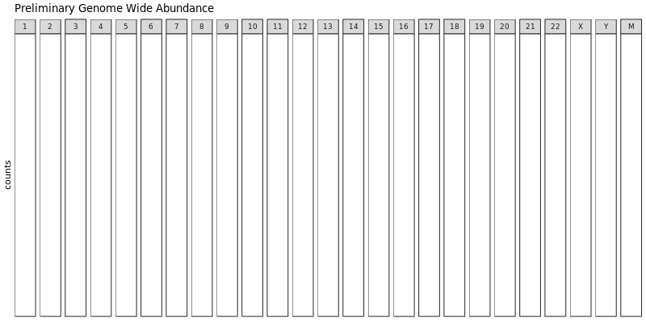
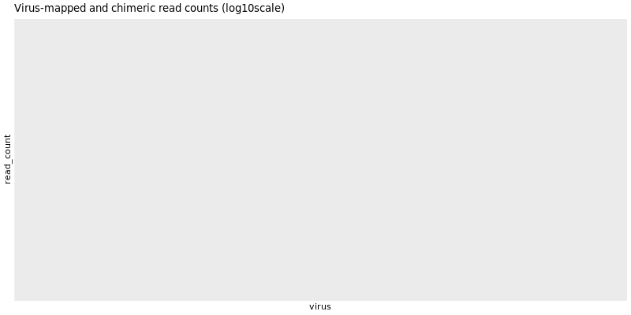
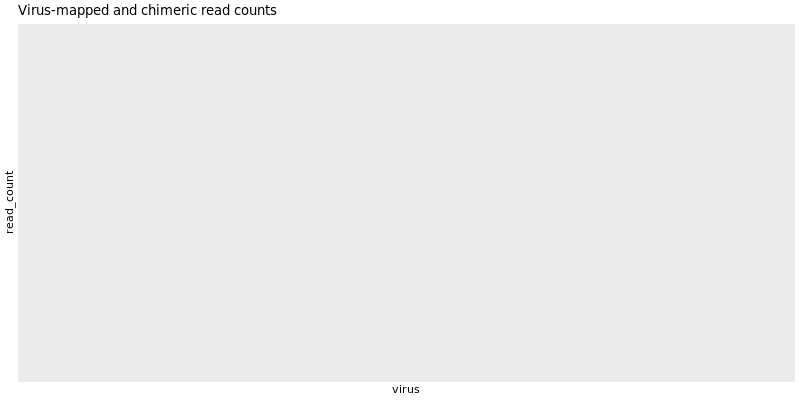
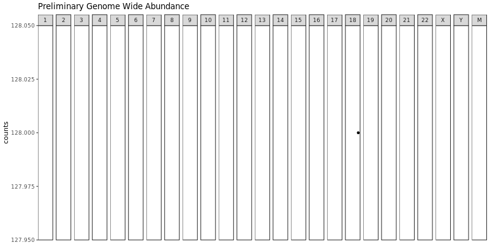
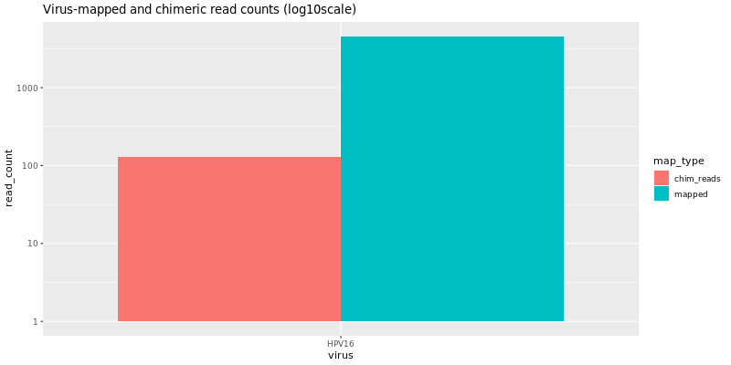
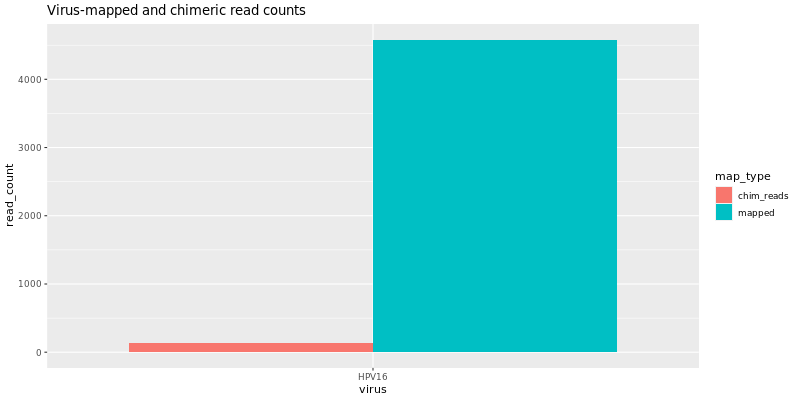
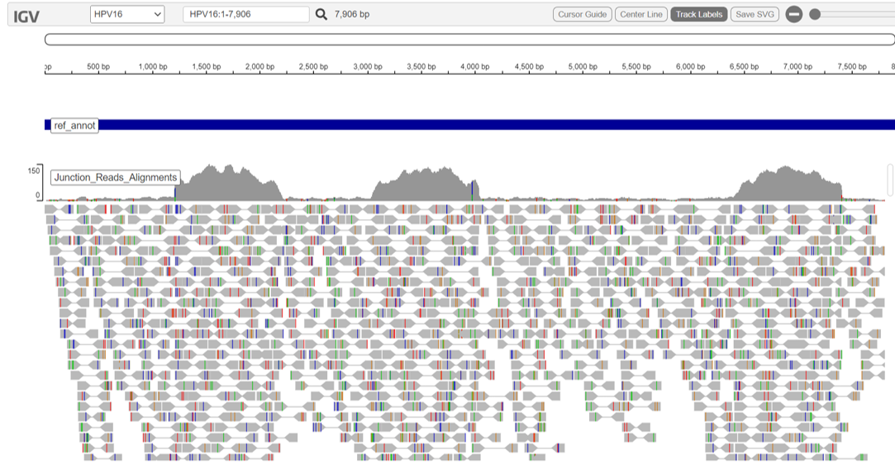
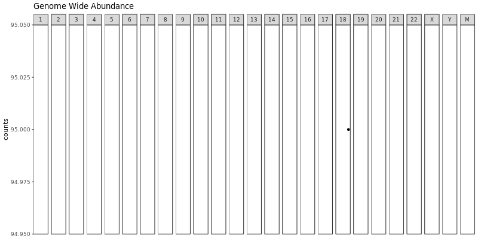
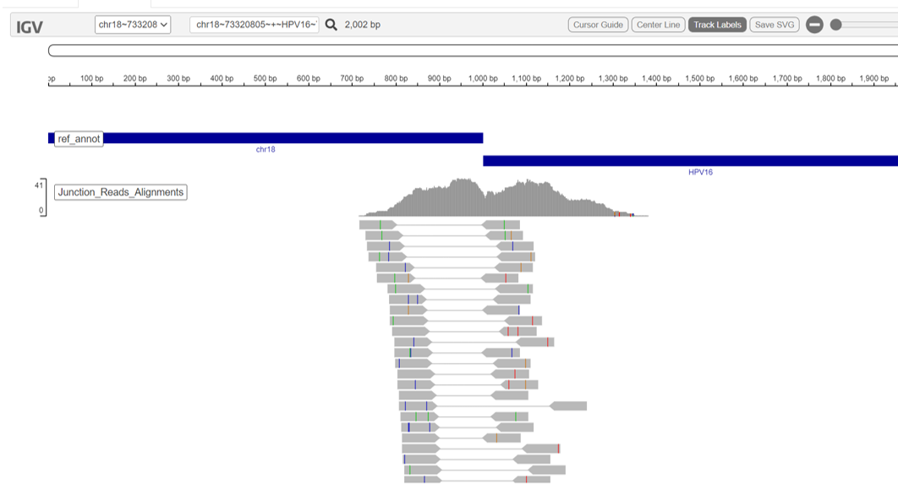

# nf-core/viralintegration: Output

## Introduction

This document describes the output produced by the pipeline. Most of the plots are taken from the MultiQC report, which summarises results at the end of the pipeline.

The directories listed below will be created in the results directory after the pipeline has finished. All paths are relative to the top-level results directory.

## Pipeline overview

The pipeline is built using [Nextflow](https://www.nextflow.io/) and processes data using the following steps:

- [Preprocessing](#preprocessing)
  - [FastQC](#fastqc) - Raw read QC
- [Alignment to Host](#alignment-to-host)
  - [STAR](#STAR) - Maps sequences against the human reference genome
  - [Trimmomatic](#trimmomatic) - Performs quality and adapter trimming
  - [PolyA Stripper](#polya-Stripper) - Strips polyA from reads
  - [CAT FASTA](#catfasta) - Joins the human and virus reference FASTAs
- [Alignment to Virus](#alignment-to-virus)
  - [STAR](#star) - Aligns unmapped sequences against the human plus virus FASTA
  - [SAMTools](#samtools) - Sort and index human plus virus alignments
- [Virus Infection Evidence Viewer](#virus-infection-evidence-viewer)
  - [Insertion Site Candidates](#insertion-site-candidates) - determines potential virus insertion sites
  - [Virus Report](#virus-report) - produces virus infection evidence igvjs report and chimeric read plots
  - [Extract Chimeric Genomic Targets](#extract-chimeric-genomic-targets) - extracts target regions for candidate integration sites
- [Virus Insertion Viewer](#virus-insertion-viewer)
  - [STAR](#STAR) - Validates mapping of sequences against the human plus virus FASTA
  - [SAMTools](#samtools) - Sort and index validated alignments
  - [Remove Duplicates](#remove-duplicates) - removes duplicate alignments
  - [Chimeric Contig Evidence Analyzer](#chimeric-contig-evidence-analyzer) - counts spanning and split evidence reads
- [Summary Report](#summary-report) - produces refined virus insertion viewer igvjs report
- [MultiQC](#multiqc) - Aggregate report describing results and QC from the whole pipeline

## Preprocessing

### FastQC

Output files

- `fastqc/`
  - `*_fastqc.html`: FastQC report containing quality metrics.
  - `*_fastqc.zip`: Zip archive containing the FastQC report, tab-delimited data file and plot images.

[FastQC](http://www.bioinformatics.babraham.ac.uk/projects/fastqc/) gives general quality metrics about your sequenced reads. It provides information about the quality score distribution across your reads, per base sequence content (%A/T/G/C), adapter contamination and overrepresented sequences. For further reading and documentation see the [FastQC help pages](http://www.bioinformatics.babraham.ac.uk/projects/fastqc/Help/).

> **NB:** The FastQC plots displayed in the MultiQC report shows _untrimmed_ reads. They may contain adapter sequence and potentially regions with low quality.

## Virus Infection Evidence Viewer

### Virus Report

Output files

- `summary/`
  - `*.VirusDetect.igvjs.html`: Web based interactive genome viewer for virus infection evidence
  - `*.VirusDetect.init.genome_plot.png`: Preliminary genome wide abundance plot
  - `*.VirusDetect.sorted.igvjs.bam`: Reads that are detected in the viral region
  - `*.VirusDetect.sorted.igvjs.bam.bai`: Index of sorted.igvjs.bam
  - `*.VirusDetect.virus_read_counts.png`: Plot of viral and chimeric read counts mapped
  - `*.VirusDetect.virus_read_counts_log.png`: Log plot of viral and chimeric read counts mapped
  - `*.VirusDetect.virus_read_counts_summary.tsv`: Viral read counts in tab-delimited format

If there isn't strong evidence for virus insertions, reads aligning to the target virus sequences can still be detected. Virus Report produces plots for virus and chimeric read counts for each sample. A preliminary genome wide abundance plot allows visualization of potential viral integration sites on specific chromosomes.

The `vif.virus.igvjs.html` provides an interactive igv-reports view, tabulating the counts of reads per virus above, and yielding the IGV view for the entry you select.

For more information, visit the documentation for [CTAT-VIF](https://github.com/broadinstitute/CTAT-VirusIntegrationFinder/wiki#virus-infection-evidence-viewer) and [IGV](https://software.broadinstitute.org/software/igv/userguide).

## Virus Insertion Viewer

### Summary Report

Output files

- `summary/`
  - `*.vif.genome_plot.png`: Refined genome wide abundance plot
  - `*.vif.html`: Web based interactive genome viewer for virus insertion sites
  - `*.vif.prelim.refined.tsv`: Preliminary insertion site candidates in tab-delimited format
  - `*.vif.refined.distilled.tsv`: Distilled insertion site candidates in tab-delimited format
  - `*.vif.refined.tsv`: Refined insertion site candidates in tab-delimited format
  - `*.vif.refined.wRefGeneAnnots.tsv`: Refined insertion site candidates in tab-delimited format with gene annotations

An interactive igv-reports html file 'vif.html' is created for navigating the read alignment evidence supporting each insertion site. The page includes a data table with all insertion sites. Click on an entry of interest and a web-based IGV panel will be displayed. The region of the human chromosome at the putative site of virus insertion is shown along with the reads aligning as split or spanning reads and providing evidence.

The `*.vif.html` also includes plots for genome wide abundance and chimeric read counts.

For more information, visit the documentation for [CTAT-VIF](https://github.com/broadinstitute/CTAT-VirusIntegrationFinder/wiki#virus-insertion-viewer) and [IGV](https://software.broadinstitute.org/software/igv/userguide).

### MultiQC

Output files

- `multiqc/`
  - `multiqc_report.html`: a standalone HTML file that can be viewed in your web browser.
  - `multiqc_data/`: directory containing parsed statistics from the different tools used in the pipeline.
  - `multiqc_plots/`: directory containing static images from the report in various formats.

[MultiQC](http://multiqc.info) is a visualization tool that generates a single HTML report summarising all samples in your project. Most of the pipeline QC results are visualised in the report and further statistics are available in the report data directory.

Results generated by MultiQC collate pipeline QC from supported tools e.g. FastQC. The pipeline has special steps which also allow the software versions to be reported in the MultiQC output for future traceability. For more information about how to use MultiQC reports, see <http://multiqc.info>.

### Pipeline information

Output files

- `pipeline_info/`
  - Reports generated by Nextflow: `execution_report.html`, `execution_timeline.html`, `execution_trace.txt` and `pipeline_dag.dot`/`pipeline_dag.svg`.
  - Reports generated by the pipeline: `pipeline_report.html`, `pipeline_report.txt` and `software_versions.yml`. The `pipeline_report*` files will only be present if the `--email` / `--email_on_fail` parameter's are used when running the pipeline.
  - Reformatted samplesheet files used as input to the pipeline: `samplesheet.valid.csv`.

[Nextflow](https://www.nextflow.io/docs/latest/tracing.html) provides excellent functionality for generating various reports relevant to the running and execution of the pipeline. This will allow you to troubleshoot errors with the running of the pipeline, and also provide you with other information such as launch commands, run times and resource usage.
